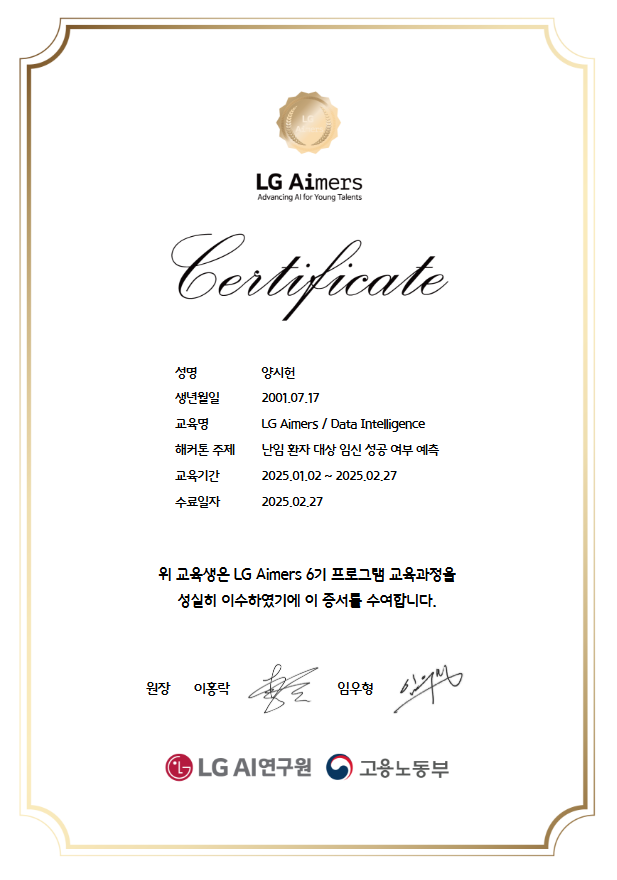

강의 자료 첫 부분에 이런 글이 나온다.

"시험에서는 틀린 만큼 합당한 벌점을 받는 것이 중요하다. 그래야 다음 시험에서 심기일전으로 공부하여 틀리는 개수를 줄일 가능성이 크기 때문이다. 틀린 개수에 상관없이 비슷한 발점을 받는다면 나태해져 성적을 올리는 데 지연이 발생할 것이다. 이러한 원리가 기계 학습에도 적용될까?"

바로 다음 페이지에 평균제곱 오차(MSE)가 나오는데, 이것이 벌점과 같은 작용을 하는 듯 하다.

평균제곱 오차는 다음과 같이 나타낸다.

y(예측값)와 o(정답값)의 차이가 클 수록 e 값이 커지므로, 벌점의 형태로서 훌륭하다고 적합하다고 볼 수 있다.

하지만 큰 허점이 존재한다.

